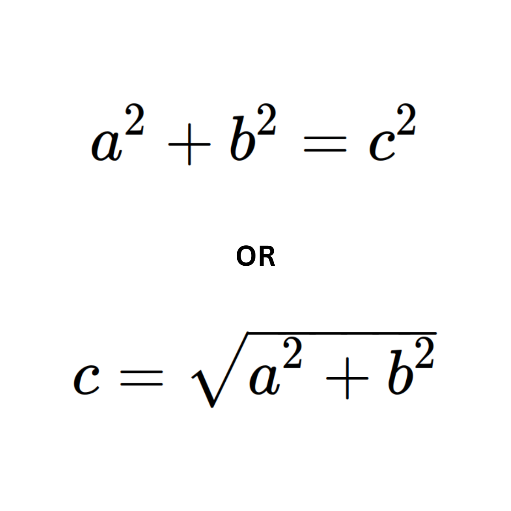

## Pythagorean Theorem (hypotenuse form)



### Python

```python
import math

def hypotenuse(a, b):
    return math.sqrt((a ** 2) + (b ** 2)) 
```

### R

```R
hypotenuse <- function(a, b) {
    sqrt((a ^ 2) + (b ^ 2))
}
```